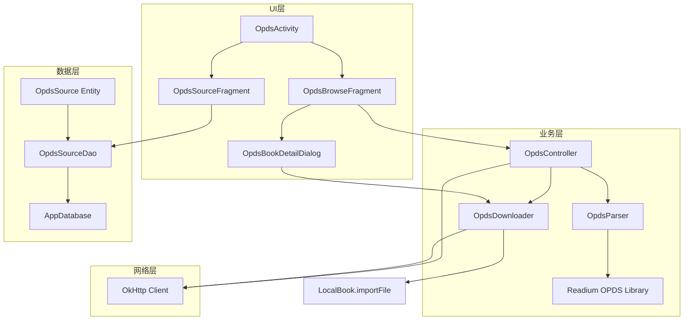

# 设计文档：OPDS 客户端支持

## 概述

为阅读（legado）应用添加 OPDS 客户端功能，使用 Readium kotlin-toolkit 的 `readium-opds` 模块解析 OPDS 1.x/2.0 Feed。设计遵循应用现有架构模式：Room 数据库存储 OPDS 源配置，OkHttp 进行网络请求，Controller 模式处理业务逻辑，Activity/Fragment 实现 UI 层。

### 关键设计决策

1. **使用 Readium OPDS 库**：复用成熟的 OPDS 解析实现，支持 OPDS 1.x 和 2.0，避免自行实现复杂的 Atom XML 解析。Readium 的 `readium-opds` 模块依赖 `readium-shared`，提供 `OPDS1Parser` 和 `OPDS2Parser`。
2. **适配层设计**：Readium 解析结果（`Feed`、`Publication` 等）通过适配层转换为应用内部的轻量数据模型，避免 Readium 类型泄漏到 UI 和数据层。
3. **复用现有模式**：OPDS 源管理参考 `RssSource` 的实体和 DAO 模式；书籍导入复用 `LocalBook.importFile` 流程。
4. **JSON 序列化**：内部数据模型使用 Gson 序列化（与项目一致），用于缓存和测试。

## 架构



### 请求流程

1. 用户在 UI 中选择一个 OPDS 源或输入 URL
2. `OpdsController` 通过 OkHttp 请求 OPDS Feed URL
3. `OpdsParser` 调用 Readium `OPDS1Parser.parse()` 或 `OPDS2Parser.parse()` 解析响应
4. 解析结果转换为内部 `OpdsFeed` / `OpdsEntry` 数据模型
5. UI 层展示导航条目或书籍列表
6. 用户选择下载时，`OpdsDownloader` 下载文件并通过 `LocalBook.importFile` 导入

## 组件与接口

### 1. OpdsParser（OPDS 解析适配器）

负责将 Readium 解析结果转换为应用内部数据模型。

```kotlin
object OpdsParser {
    /**
     * 解析 OPDS Feed XML/JSON 内容
     * @param content 原始响应内容
     * @param url Feed 的 URL
     * @return 解析后的 OpdsFeed，解析失败时抛出异常
     */
    suspend fun parseFeed(content: String, url: String): OpdsFeed

    /**
     * 解析 OpenSearch Descriptor XML
     * @param content OpenSearch XML 内容
     * @return 搜索 URL 模板字符串，解析失败返回 null
     */
    fun parseOpenSearchDescriptor(content: String): String?
}
```

### 2. OpdsController（业务控制器）

协调网络请求、解析和数据转换。

```kotlin
object OpdsController {
    /**
     * 获取并解析 OPDS Feed
     * @param url Feed URL
     * @param username HTTP Basic 认证用户名（可选）
     * @param password HTTP Basic 认证密码（可选）
     * @return OpdsFeed 数据模型
     */
    suspend fun fetchFeed(url: String, username: String? = null, password: String? = null): OpdsFeed

    /**
     * 执行 OPDS 搜索
     * @param searchUrlTemplate OpenSearch URL 模板
     * @param query 搜索关键词
     * @param username HTTP Basic 认证用户名（可选）
     * @param password HTTP Basic 认证密码（可选）
     * @return 搜索结果 OpdsFeed
     */
    suspend fun search(
        searchUrlTemplate: String,
        query: String,
        username: String? = null,
        password: String? = null
    ): OpdsFeed
}
```

### 3. OpdsDownloader（书籍下载器）

负责从 OPDS 获取链接下载书籍文件并导入。

```kotlin
object OpdsDownloader {
    /**
     * 下载书籍并导入到本地书架
     * @param entry OPDS 书籍条目
     * @param acquisitionLink 选择的下载链接
     * @param username HTTP Basic 认证用户名（可选）
     * @param password HTTP Basic 认证密码（可选）
     * @return 导入后的 Book 实体
     */
    suspend fun downloadAndImport(
        entry: OpdsEntry,
        acquisitionLink: OpdsLink,
        username: String? = null,
        password: String? = null
    ): Book
}
```

### 4. UI 组件

- **OpdsActivity**：OPDS 功能主入口，包含源管理和浏览两个 Fragment
- **OpdsSourceFragment**：OPDS 源列表管理（增删改查）
- **OpdsBrowseFragment**：OPDS 目录浏览，支持导航栈（返回上级目录）、分页加载
- **OpdsBookDetailDialog**：书籍详情弹窗，显示书籍信息和下载格式选择

## 数据模型

### OpdsSource（OPDS 源实体 - Room Entity）

```kotlin
@Entity(tableName = "opdsSources")
data class OpdsSource(
    @PrimaryKey
    var sourceUrl: String = "",        // OPDS 目录根 URL
    var sourceName: String = "",       // 源名称
    var username: String? = null,      // HTTP Basic 认证用户名
    var password: String? = null,      // HTTP Basic 认证密码
    var sortOrder: Int = 0,            // 排序顺序
    var lastAccessTime: Long = 0L,     // 最后访问时间
    var enabled: Boolean = true        // 是否启用
)
```

### OpdsFeed（解析后的 Feed 数据模型）

```kotlin
data class OpdsFeed(
    val id: String,                        // Feed ID
    val title: String,                     // Feed 标题
    val updated: String? = null,           // 更新时间
    val author: String? = null,            // Feed 作者
    val entries: List<OpdsEntry> = emptyList(),  // 条目列表
    val links: List<OpdsLink> = emptyList(),     // Feed 级别链接
    val isNavigation: Boolean = false,     // 是否为导航 Feed
    val searchUrl: String? = null          // OpenSearch URL 模板
) {
    /** 获取下一页链接 */
    val nextPageUrl: String?
        get() = links.firstOrNull { it.rel == "next" }?.href
}
```

### OpdsEntry（Feed 条目数据模型）

```kotlin
data class OpdsEntry(
    val id: String,                        // 条目 ID
    val title: String,                     // 标题
    val author: String? = null,            // 作者
    val summary: String? = null,           // 简介/摘要
    val content: String? = null,           // 详细内容
    val updated: String? = null,           // 更新时间
    val coverUrl: String? = null,          // 封面图片 URL
    val links: List<OpdsLink> = emptyList(),     // 所有链接
    val acquisitionLinks: List<OpdsLink> = emptyList()  // 获取/下载链接
) {
    /** 是否为导航条目（有子 Feed 链接） */
    val isNavigation: Boolean
        get() = links.any {
            it.type?.contains("opds-catalog") == true ||
            it.rel == "subsection"
        }

    /** 获取导航链接 URL */
    val navigationUrl: String?
        get() = links.firstOrNull {
            it.type?.contains("opds-catalog") == true ||
            it.rel == "subsection"
        }?.href

    /** 是否有可下载的书籍文件 */
    val hasAcquisitions: Boolean
        get() = acquisitionLinks.isNotEmpty()
}
```

### OpdsLink（链接数据模型）

```kotlin
data class OpdsLink(
    val href: String,                      // 链接 URL
    val type: String? = null,              // MIME 类型
    val rel: String? = null,               // 链接关系
    val title: String? = null,             // 链接标题
    val length: Long? = null               // 文件大小（字节）
) {
    /** 获取人类可读的格式名称 */
    val formatName: String
        get() = when (type) {
            "application/epub+zip" -> "EPUB"
            "application/pdf" -> "PDF"
            "application/x-mobipocket-ebook" -> "MOBI"
            "application/x-cbz" -> "CBZ"
            "application/x-cbr" -> "CBR"
            "text/plain" -> "TXT"
            else -> type ?: "未知格式"
        }

    /** 是否为获取链接 */
    val isAcquisition: Boolean
        get() = rel?.contains("acquisition") == true ||
                rel == "http://opds-spec.org/acquisition" ||
                rel == "http://opds-spec.org/acquisition/open-access"
}
```

### OpdsSourceDao（数据访问对象）

```kotlin
@Dao
interface OpdsSourceDao {
    @Query("SELECT * FROM opdsSources ORDER BY sortOrder")
    fun getAll(): List<OpdsSource>

    @Query("SELECT * FROM opdsSources ORDER BY sortOrder")
    fun flowAll(): Flow<List<OpdsSource>>

    @Query("SELECT * FROM opdsSources WHERE sourceUrl = :url")
    fun getByUrl(url: String): OpdsSource?

    @Insert(onConflict = OnConflictStrategy.REPLACE)
    fun insert(source: OpdsSource)

    @Update
    fun update(source: OpdsSource)

    @Delete
    fun delete(source: OpdsSource)

    @Query("SELECT EXISTS(SELECT 1 FROM opdsSources WHERE sourceUrl = :url)")
    fun has(url: String): Boolean
}
```

### 数据库迁移

在 `AppDatabase` 中添加 `opdsSources` 表，通过 Room Migration 实现。


## 正确性属性

*正确性属性是一种在系统所有有效执行中都应成立的特征或行为——本质上是关于系统应该做什么的形式化陈述。属性作为人类可读规范和机器可验证正确性保证之间的桥梁。*

### Property 1: OPDS Feed 转换完整性

*For any* 有效的 OPDS Atom XML 字符串，解析并转换为 OpdsFeed 后，结果应包含：正确的 Feed 类型标识（Navigation 或 Acquisition）、所有条目的 id/title/author/summary/links 字段、分页链接（如存在）、以及所有 Acquisition Link 的 href 和 type。

**Validates: Requirements 1.2, 1.3, 1.4, 1.5, 1.6**

### Property 2: 无效 XML 产生解析错误

*For any* 不合法的 XML 字符串（随机字节序列、截断的 XML、缺少根元素的文本），解析操作应返回错误结果而非崩溃，且错误信息应为非空字符串。

**Validates: Requirements 1.7**

### Property 3: OpdsFeed JSON 往返一致性

*For any* 有效的 OpdsFeed 对象，将其序列化为 JSON 字符串后再反序列化，应产生与原始对象等价的 OpdsFeed。

**Validates: Requirements 2.1, 2.2, 2.3**

### Property 4: OpdsEntry 到 Book 元数据保留

*For any* 包含书名、作者、简介和封面 URL 的 OpdsEntry，转换为 Book_Entity 后，Book_Entity 的 name、author、intro 和 coverUrl 字段应与 OpdsEntry 中的对应值一致。

**Validates: Requirements 4.3**

### Property 5: OpenSearch URL 模板替换正确性

*For any* 合法的 OpenSearch URL 模板和非空搜索关键词，构造出的搜索 URL 应包含该关键词，且 URL 格式合法。

**Validates: Requirements 5.2**

### Property 6: URL 格式验证正确性

*For any* 字符串，URL 验证函数应对以 `http://` 或 `https://` 开头且包含有效主机名的字符串返回 true，对其他字符串返回 false。

**Validates: Requirements 6.5**

### Property 7: OpdsSource 数据库 CRUD 往返一致性

*For any* 有效的 OpdsSource 对象，插入数据库后再查询，应返回与原始对象等价的 OpdsSource。

**Validates: Requirements 6.1, 6.2, 6.3, 6.4**

## 错误处理

| 错误场景 | 处理方式 |
|---------|---------|
| 网络请求失败（超时、DNS 解析失败等） | 捕获 IOException，向 UI 层返回网络错误提示，允许重试 |
| OPDS XML 解析失败 | 捕获 Readium 解析异常，返回格式错误提示 |
| HTTP 401/403 认证失败 | 提示用户检查用户名和密码配置 |
| HTTP 404 资源不存在 | 提示 OPDS 目录地址无效 |
| 下载文件失败 | 显示错误信息，保留下载按钮允许重试 |
| 下载文件格式不支持 | 提示用户该格式暂不支持导入 |
| 数据库操作失败 | 捕获 Room 异常，记录日志并提示用户 |
| URL 格式不合法 | 在添加源时即时提示 URL 格式错误 |

## 测试策略

### 单元测试

- **OpdsParser 测试**：使用预置的 OPDS XML 样本测试解析和转换逻辑
  - 测试 OPDS 1.2 Navigation Feed 解析
  - 测试 OPDS 1.2 Acquisition Feed 解析
  - 测试 OPDS 2.0 Feed 解析
  - 测试无效 XML 的错误处理
  - 测试 OpenSearch Descriptor 解析

- **数据模型测试**：测试 OpdsFeed、OpdsEntry、OpdsLink 的辅助方法
  - 测试 OpdsEntry.isNavigation 判断逻辑
  - 测试 OpdsEntry.hasAcquisitions 判断逻辑
  - 测试 OpdsLink.formatName 格式名称映射
  - 测试 OpdsLink.isAcquisition 判断逻辑

- **URL 验证测试**：测试各种 URL 格式的验证结果

### 属性测试

使用 Kotlin 属性测试库（如 Kotest Property Testing 或 jqwik）实现以下属性测试，每个属性至少运行 100 次迭代：

- **Property 1**：生成随机 OPDS XML（基于有效模板），验证转换完整性
  - Tag: **Feature: opds-support, Property 1: OPDS Feed conversion preserves all fields**
- **Property 2**：生成随机无效字符串，验证解析器不崩溃
  - Tag: **Feature: opds-support, Property 2: Invalid XML produces parse error**
- **Property 3**：生成随机 OpdsFeed 对象，验证 JSON 往返一致性
  - Tag: **Feature: opds-support, Property 3: OpdsFeed JSON round-trip consistency**
- **Property 4**：生成随机 OpdsEntry，验证到 Book 的元数据保留
  - Tag: **Feature: opds-support, Property 4: OpdsEntry to Book metadata preservation**
- **Property 5**：生成随机 URL 模板和关键词，验证搜索 URL 构造
  - Tag: **Feature: opds-support, Property 5: OpenSearch URL template substitution**
- **Property 6**：生成随机字符串，验证 URL 验证函数
  - Tag: **Feature: opds-support, Property 6: URL validation correctness**
- **Property 7**：生成随机 OpdsSource，验证数据库 CRUD 往返（需 Room 测试环境）
  - Tag: **Feature: opds-support, Property 7: OpdsSource CRUD round-trip**

### 测试框架选择

- 属性测试库：**Kotest Property Testing**（`io.kotest:kotest-property`），与 Kotlin 生态兼容良好
- 单元测试框架：JUnit 4（项目已有依赖）
- 数据库测试：Room Testing（项目已有依赖 `room-testing`）
