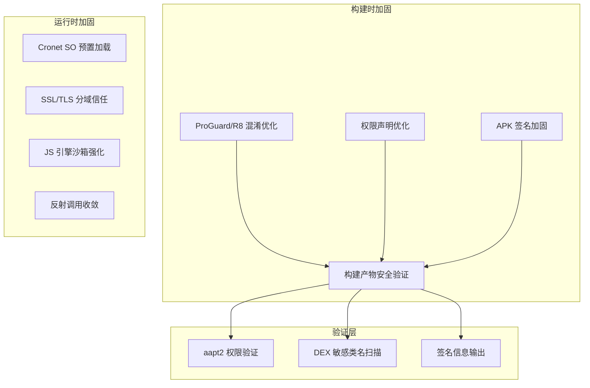
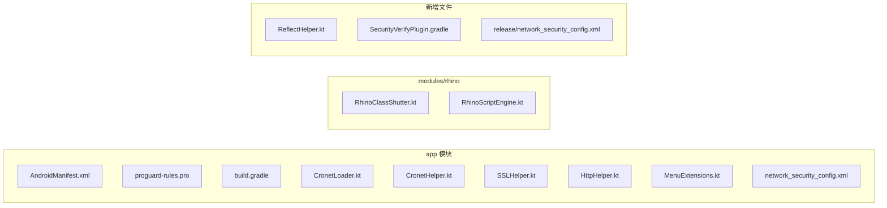

# 技术设计文档：安全加固 — 消除 a.gray.BulomiaTGen.f 误报

## 概述

本设计文档针对 legado（阅读）Android 应用在手机管家中被误报为 `a.gray.BulomiaTGen.f` 灰色软件的问题，制定全面的安全加固技术方案。

通过对项目代码的深入分析，识别出以下核心触发因素及其在代码中的具体位置：

| 触发因素 | 代码位置 | 风险等级 |
|---------|---------|---------|
| 动态下载并加载 SO 库 | `CronetLoader.kt` - 从 `storage.googleapis.com` 下载 `libcronet.*.so` | 高 |
| 全局禁用 SSL 证书校验 | `SSLHelper.kt` - `unsafeTrustManager`；`CronetHelper.kt` - `disableCertificateVerify()` | 高 |
| 反射替换系统安全组件 | `CronetHelper.kt` - 反射修改 `X509Util.sDefaultTrustManager` | 高 |
| 敏感权限组合 | `AndroidManifest.xml` - `READ_PHONE_STATE` + `REQUEST_INSTALL_PACKAGES` + `MANAGE_EXTERNAL_STORAGE` | 中 |
| 宽泛的 ProGuard keep 规则 | `proguard-rules.pro` - 多处 `{*;}` 全量保留 | 中 |
| 内嵌 JS 引擎执行动态代码 | `modules/rhino` - Rhino 引擎 + `RhinoClassShutter.kt` | 中 |
| 大量散布的反射调用 | `MenuExtensions.kt`、`ViewExtensions.kt`、`CronetLoader.kt` 等 | 低 |

加固策略的核心原则：**在不破坏应用功能的前提下，消除安全扫描器的行为特征匹配**。

## 架构

### 整体加固架构



### 变更影响范围



## 组件与接口

### 1. CronetLoader 重构

**当前问题**：`CronetLoader.kt` 从 `storage.googleapis.com` 动态下载 SO 文件并通过 `System.load()` 加载，这是灰色软件的典型行为特征。

**设计方案**：

```kotlin
// 重构后的 CronetLoader 加载策略
object CronetLoader : CronetEngine.Builder.LibraryLoader(), Cronet.LoaderInterface {

    override fun install(): Boolean {
        // 1. 优先检查 APK 内预置的 jniLibs
        // 2. 回退到 GMS Cronet Provider
        // 3. 不再从远程下载
    }

    override fun loadLibrary(libName: String) {
        // 仅调用 System.loadLibrary(libName)
        // 移除所有 System.load(absolutePath) 调用
        // 移除所有远程下载逻辑
    }
}
```

**关键变更**：
- 移除 `downloadFileIfNotExist()`、`download()`、`copyFile()` 等远程下载方法
- 移除 `soUrl`、`downloadFile` 等下载相关字段
- `loadLibrary()` 简化为仅调用 `System.loadLibrary(libName)`
- 构建时通过 `jniLibs` 预置 SO 文件到 APK 中
- 在 `app/build.gradle` 中配置 `jniLibs.srcDirs` 指向预置 SO 目录

### 2. SSL/TLS 安全配置重构

**当前问题**：
- `SSLHelper.unsafeTrustManager` 信任所有证书，被全局 `okHttpClient` 使用
- `CronetHelper.disableCertificateVerify()` 通过反射替换 Cronet 的信任管理器
- `network_security_config.xml` 的 `base-config` 允许明文流量

**设计方案**：

```kotlin
object SSLHelper {
    // 保留 unsafeTrustManager 但仅供特定书源使用
    // 新增：为特定书源创建独立的 OkHttpClient
    fun createPerSourceClient(
        baseClient: OkHttpClient,
        enableUnsafeSSL: Boolean
    ): OkHttpClient {
        if (!enableUnsafeSSL) return baseClient
        return baseClient.newBuilder()
            .sslSocketFactory(unsafeSSLSocketFactory, unsafeTrustManager)
            .hostnameVerifier(unsafeHostnameVerifier)
            .build()
    }
}
```

**关键变更**：
- `HttpHelper.kt` 中的全局 `okHttpClient` 改用系统默认证书校验
- `CronetHelper.kt` 中移除 `disableCertificateVerify()` 方法及其调用
- `proguard-rules.pro` 中移除 `X509Util` 字段的 keep 规则
- 新增 `app/src/release/res/xml/network_security_config.xml`，release 构建中 `cleartextTrafficPermitted="false"`
- 保留 `app/src/debug/res/xml/network_security_config.xml` 允许明文流量用于调试
- 书源级别的 SSL 绕过通过 `createPerSourceClient()` 实现，不影响全局

### 3. RhinoClassShutter 白名单强化

**当前问题**：`RhinoClassShutter` 使用黑名单机制（`protectedClassNamesMatcher`），未列入黑名单的类默认可访问。

**设计方案**：

```kotlin
object RhinoClassShutter : ClassShutter {
    // 改为白名单机制
    private val allowedPrefixes = listOf(
        "java.lang.String",
        "java.lang.Integer", "java.lang.Long", "java.lang.Double",
        "java.lang.Boolean", "java.lang.Float", "java.lang.Byte",
        "java.lang.Short", "java.lang.Character",
        "java.lang.Math",
        "java.util.ArrayList", "java.util.HashMap", "java.util.LinkedHashMap",
        "java.util.Arrays", "java.util.Collections", "java.util.regex",
        "java.text.SimpleDateFormat", "java.text.DecimalFormat",
        "java.net.URLEncoder", "java.net.URLDecoder",
        "org.jsoup",
        "cn.hutool.core.codec", "cn.hutool.core.util.HexUtil",
        "cn.hutool.core.util.CharsetUtil", "cn.hutool.core.util.StrUtil",
        "cn.hutool.crypto",
        "io.legado.app.help.JsExtensions",
        // ... 其他明确授权的类
    )

    // 保留黑名单作为额外安全层（双重检查）
    private val blockedPrefixes = listOf(
        "java.lang.Runtime", "java.lang.ProcessBuilder",
        "java.lang.reflect", "java.lang.invoke",
        "java.io.File", "java.net.URLClassLoader",
        "dalvik.system", "com.script", "org.mozilla",
    )

    override fun visibleToScripts(fullClassName: String): Boolean {
        // 先检查黑名单（优先级最高）
        if (blockedPrefixes.any { fullClassName.startsWith(it) }) return false
        // 再检查白名单
        return allowedPrefixes.any { fullClassName.startsWith(it) }
    }
}
```

**关键变更**：
- 从黑名单机制改为白名单 + 黑名单双重检查
- 黑名单优先级高于白名单，确保危险类无法通过白名单绕过
- 白名单仅包含 JS 书源实际需要的 Java 类
- `RhinoScriptEngine.kt` 中已有 `instructionObserverThreshold = 10000` 和 `maximumInterpreterStackDepth = 1000`，需增加执行超时机制

### 4. 反射调用收敛

**当前问题**：反射调用散布在多个文件中：
- `MenuExtensions.kt` - `setOptionalIconsVisible` 反射
- `ViewExtensions.kt` - `ViewPager` edge 字段、`PopupMenu.mPopup` 字段
- `CronetLoader.kt` - `ApplicationInfo.primaryCpuAbi` 反射
- `TintHelper.kt` - `TextView.mCursorDrawableRes` 等反射
- `PreferencesExtensions.kt` - `ContextWrapper.mBase` 反射
- `ChangeBookSourceDialog.kt` - `Toolbar.mNavButtonView` 反射

**设计方案**：

```kotlin
// 新增统一反射工具类
@Suppress("DiscouragedPrivateApi")
object ReflectHelper {
    /**
     * 安全地获取字段值，失败时返回 null
     */
    @SuppressLint("DiscouragedPrivateApi")
    inline fun <reified T> getFieldValue(
        target: Any, fieldName: String
    ): T? = runCatching {
        target.javaClass.getDeclaredField(fieldName).apply {
            isAccessible = true
        }.get(target) as? T
    }.getOrNull()

    /**
     * 安全地调用方法
     */
    @SuppressLint("DiscouragedPrivateApi")
    fun invokeMethod(
        target: Any, methodName: String,
        paramTypes: Array<Class<*>> = emptyArray(),
        args: Array<Any?> = emptyArray()
    ): Any? = runCatching {
        target.javaClass.getDeclaredMethod(methodName, *paramTypes).apply {
            isAccessible = true
        }.invoke(target, *args)
    }.getOrNull()
}
```

**可替代的反射调用**：
- `MenuExtensions.kt` 中的 `setOptionalIconsVisible` → 使用 `MenuCompat.setGroupDividerEnabled()` 或 `MenuBuilder` 的公开 API
- `CronetLoader.kt` 中的 `primaryCpuAbi` → 使用 `Build.SUPPORTED_ABIS[0]`（已有回退逻辑）

### 5. 权限声明优化

**当前 AndroidManifest.xml 权限分析**：

| 权限 | 处理方式 | 原因 |
|-----|---------|------|
| `READ_PHONE_STATE` | **移除** | 代码中无电话状态监听需求 |
| `REQUEST_INSTALL_PACKAGES` | **移除** | 代码中无 APK 安装逻辑 |
| `MANAGE_EXTERNAL_STORAGE` | **添加 maxSdkVersion** | 仅在 Android 10 以下需要 |
| `READ_EXTERNAL_STORAGE` | 保留 | 文件读取需要 |
| `WRITE_EXTERNAL_STORAGE` | 保留 | 文件写入需要 |
| `INTERNET` | 保留 | 核心网络功能 |

### 6. ProGuard/R8 混淆优化

**当前问题分析**：
- `okhttp3.*{*;}` — 全量保留 OkHttp，应缩小范围
- `okio.*{*;}` — 全量保留 Okio，应缩小范围
- `com.jayway.jsonpath.*{*;}` — 全量保留 JsonPath
- `org.jsoup.**{*;}` — 全量保留 Jsoup
- `**.data.entities.**{*;}` — 保留所有数据实体（Room 需要，但可精确化）

**优化方案**：

```proguard
# 优化前
-keep class okhttp3.*{*;}
-keep class okio.*{*;}

# 优化后 - 仅保留 JS 引擎需要访问的公开 API
-keep,allowobfuscation class okhttp3.** { *; }
-keep class okhttp3.Headers { public *; }
-keep class okhttp3.Response { public *; }
-keep class okhttp3.Request { public *; }
-keep class okhttp3.RequestBody { public *; }
```

**R8 Full Mode 启用**：
在 `gradle.properties` 中添加：
```properties
android.enableR8.fullMode=true
```

### 7. APK 签名加固

**当前问题**：
- 签名密钥库 `legado-release.jks` 存放在项目根目录并提交到版本控制
- 密码明文写在 `gradle.properties` 中：`RELEASE_STORE_PASSWORD=legado123`
- 密码强度极低（`legado123`）

**设计方案**：
- 验证当前签名密钥强度（RSA 2048+）
- 将密钥库和密码移至环境变量或 CI/CD 密钥管理
- 在 `.gitignore` 中添加 `legado-release.jks` 和敏感属性
- 构建后输出签名信息摘要的 Gradle task

### 8. 构建产物安全验证

**设计方案**：新增 Gradle 自定义 task `verifyReleaseSecurity`

```groovy
// SecurityVerifyPlugin.gradle
tasks.register('verifyReleaseSecurity') {
    dependsOn 'assembleAppRelease'
    doLast {
        // 1. 使用 aapt2 dump permissions 检查权限
        // 2. 扫描 DEX 中的未混淆敏感类名
        // 3. 输出签名信息摘要
        // 4. 生成安全验证报告
    }
}
```

## 数据模型

本次安全加固主要涉及配置和代码变更，不涉及新的数据模型。以下是关键配置数据结构：

### ProGuard 规则配置

```
proguard-rules.pro          # 主混淆规则（优化后）
cronet-proguard-rules.pro   # Cronet 专用规则（保持不变）
```

### 网络安全配置（按构建变体）

```
app/src/main/res/xml/network_security_config.xml     # 默认配置
app/src/release/res/xml/network_security_config.xml   # Release 配置（禁止明文）
app/src/debug/res/xml/network_security_config.xml     # Debug 配置（允许明文+用户证书）
```

### 书源 SSL 配置模型

书源的 SSL 绕过配置通过现有的书源数据模型中的标志位控制，不需要新增数据表。每个书源可独立配置是否跳过证书校验，该配置在创建 OkHttpClient 时生效。


## 正确性属性（Correctness Properties）

*属性是一种在系统所有有效执行中都应保持为真的特征或行为——本质上是关于系统应该做什么的形式化陈述。属性是人类可读规范与机器可验证正确性保证之间的桥梁。*

基于需求文档中的验收标准，经过可测试性分析和冗余消除后，提炼出以下正确性属性：

### Property 1: ClassShutter 白名单阻断性

*For any* 类名字符串，如果该类名不在白名单允许的前缀列表中，则 `RhinoClassShutter.visibleToScripts()` 应返回 `false`；如果该类名在黑名单中，则无论白名单如何配置，都应返回 `false`。

**Validates: Requirements 5.1, 5.3, 5.5**

> 推导：需求 5.1 要求白名单机制，5.3 要求阻止特定危险类，5.5 要求阻止 `java.lang.reflect` 包。这三个需求本质上都是关于 ClassShutter 的访问控制策略。5.3 和 5.5 是 5.1 的具体实例（边界情况），合并为一个综合属性：对任意类名，ClassShutter 的行为由白名单和黑名单共同决定，黑名单优先。

### Property 2: 危险类访问触发安全异常

*For any* 被 ClassShutter 阻止的类名，当 JS 脚本尝试访问该类时，JS 引擎应抛出安全异常（而非静默失败或返回 null）。

**Validates: Requirements 5.4**

> 推导：需求 5.4 要求访问被禁止的类时抛出安全异常。这与 Property 1 互补——Property 1 验证阻断决策的正确性，Property 2 验证阻断后的错误处理行为。

### Property 3: JS 脚本执行超时终止

*For any* JS 脚本，如果其执行时间超过配置的超时阈值，JS 引擎应中断执行并抛出超时异常。

**Validates: Requirements 5.2**

> 推导：需求 5.2 要求对脚本执行设置时间限制。我们可以生成随机的长时间运行脚本（如无限循环），验证引擎在超时后正确中断。

### Property 4: Cronet SO 预置加载优先

*For any* 加载请求，当 APK 内预置了对应架构的 SO 库时，CronetLoader 应通过 `System.loadLibrary()` 加载而非尝试远程下载。

**Validates: Requirements 3.1, 3.3**

> 推导：需求 3.1 要求优先使用预置 SO，3.3 要求移除远程下载逻辑。合并为一个属性：加载行为不应包含任何网络请求。

### Property 5: 域级 SSL 信任隔离

*For any* 两个不同的书源配置（一个启用 SSL 绕过，一个不启用），通过 `createPerSourceClient()` 创建的 OkHttpClient 实例应具有不同的 SSL 配置，且启用绕过的客户端不应影响全局 `okHttpClient` 的证书校验行为。

**Validates: Requirements 4.2, 4.5**

> 推导：需求 4.2 要求针对特定域名的证书信任，4.5 要求将 SSL 绕过限定在特定书源范围内。两者本质上都是关于 SSL 配置的作用域隔离，合并为一个属性。

### Property 6: 敏感类名模式检测

*For any* DEX 文件内容，如果其中包含未混淆的敏感类名模式（如 `Runtime`、`ProcessBuilder`、`ClassLoader` 等关键词出现在类定义中），安全扫描逻辑应将其标记为警告。

**Validates: Requirements 8.4**

> 推导：需求 8.4 要求检测未混淆的敏感类名。我们可以生成包含和不包含敏感模式的模拟 DEX 内容，验证检测逻辑的准确性。

### Property 7: SO 文件完整性校验（条件性）

*For any* 下载的 SO 文件，如果其 SHA-256 哈希值与预期值不匹配，CronetLoader 应拒绝加载该文件。

**Validates: Requirements 3.4**

> 推导：需求 3.4 要求对下载文件执行 SHA-256 校验。虽然主方案移除了远程下载，但如果保留下载能力作为备选，此属性确保完整性校验的正确性。这是一个经典的校验 round-trip 属性。

## 错误处理

### 1. Cronet 加载失败

| 场景 | 处理方式 |
|-----|---------|
| 预置 SO 加载失败 | 回退到 GMS Cronet Provider |
| GMS Provider 不可用 | 回退到纯 OkHttp（禁用 Cronet） |
| 所有方式均失败 | 记录 AppLog，使用 OkHttp 继续运行 |

### 2. SSL 配置错误

| 场景 | 处理方式 |
|-----|---------|
| 系统默认证书链验证失败 | 对于启用了 SSL 绕过的书源，使用 per-source unsafe client |
| per-source client 创建失败 | 回退到全局 client，记录警告日志 |
| network_security_config 解析错误 | Android 系统使用默认安全策略 |

### 3. JS 引擎安全异常

| 场景 | 处理方式 |
|-----|---------|
| 脚本访问被禁止的类 | 抛出 `SecurityException`，记录警告日志，终止当前脚本执行 |
| 脚本执行超时 | 抛出 `ScriptTimeoutException`，中断执行，释放资源 |
| 脚本内存超限 | 通过 `instructionObserverThreshold` 限制，超限后中断 |

### 4. 混淆导致的运行时错误

| 场景 | 处理方式 |
|-----|---------|
| `ClassNotFoundException` | 通过 `mapping.txt` 追溯，添加精确 `-keep` 规则 |
| `NoSuchMethodException` | 同上，检查反射目标是否有对应 keep 规则 |
| 序列化/反序列化失败 | 检查 Room 实体和 Gson 序列化类的 keep 规则 |

## 测试策略

### 测试框架选择

- **单元测试**：JUnit 5 + Robolectric（已在项目依赖中）
- **属性测试**：Kotest Property-Based Testing（`io.kotest:kotest-property`，已在项目依赖中）
- **构建验证**：Gradle 自定义 task + shell 脚本

### 属性测试配置

每个属性测试运行最少 100 次迭代，使用 Kotest 的 `forAll` 或 `checkAll` 生成器。

每个测试必须通过注释引用设计文档中的属性编号：

```kotlin
// Feature: security-hardening, Property 1: ClassShutter 白名单阻断性
```

### 测试分类

#### 属性测试（Property-Based Tests）

| 属性 | 测试描述 | 生成器 |
|-----|---------|-------|
| Property 1 | 生成随机类名，验证 ClassShutter 的白名单/黑名单决策 | `Arb.string()` 生成随机类名 + 已知白名单/黑名单类名 |
| Property 2 | 对所有被阻止的类名，验证 JS 引擎抛出安全异常 | 从黑名单中随机选取类名 |
| Property 3 | 生成随机超时阈值和长时间运行脚本，验证超时中断 | `Arb.long(range)` 生成超时值 |
| Property 4 | 模拟不同的 SO 可用性场景，验证加载策略 | `Arb.boolean()` 控制 SO 是否预置 |
| Property 5 | 生成随机书源配置（启用/不启用 SSL 绕过），验证客户端隔离 | `Arb.boolean()` 控制 SSL 绕过开关 |
| Property 6 | 生成包含/不包含敏感模式的类名列表，验证检测逻辑 | `Arb.string()` + 敏感关键词注入 |
| Property 7 | 生成随机文件内容和哈希值，验证校验逻辑 | `Arb.byteArray()` 生成随机内容 |

#### 单元测试（Unit Tests）

| 测试目标 | 测试内容 |
|---------|---------|
| AndroidManifest 权限 | 验证 `READ_PHONE_STATE` 和 `REQUEST_INSTALL_PACKAGES` 已移除 |
| network_security_config | 验证 release 配置中 `cleartextTrafficPermitted="false"` |
| ProGuard 规则 | 验证 `-flattenpackagehierarchy` 和 Log 移除规则存在 |
| 签名配置 | 验证 V1-V4 签名方案均已启用 |
| CronetLoader | 验证不包含 `storage.googleapis.com` URL |
| CronetHelper | 验证不包含 `disableCertificateVerify` 方法 |
| 全局 OkHttpClient | 验证不使用 `unsafeTrustManager` |

#### 构建验证测试

| 验证项 | 工具 | 预期结果 |
|-------|------|---------|
| 权限清单 | `aapt2 dump permissions` | 不包含 `READ_PHONE_STATE`、`REQUEST_INSTALL_PACKAGES` |
| 混淆效果 | `mapping.txt` 分析 | 关键类名已被混淆 |
| 签名信息 | `apksigner verify --print-certs` | RSA 2048+，V1-V4 签名 |
| SO 预置 | `unzip -l *.apk` | 包含 `lib/arm64-v8a/libcronet.*.so` |
